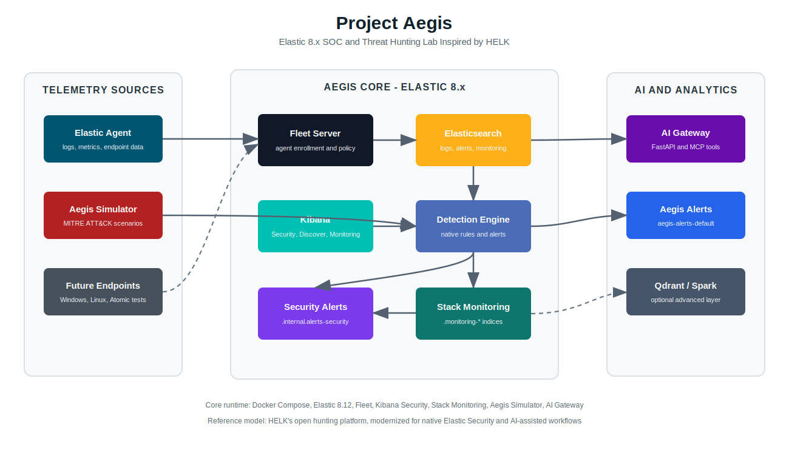

# Project Aegis

[](https://opensource.org/licenses/MIT)
[](https://www.elastic.co/)
[](https://github.com/mkenney/software-guides/blob/master/STABILITY-BADGES.md#alpha)
[](https://modelcontextprotocol.io/)

Project Aegis is a modern SOC and Threat Hunting lab inspired by the ideas behind [The Hunting ELK (HELK)](https://github.com/Cyb3rWard0g/HELK). HELK proved the value of an open hunting platform with Elasticsearch, Kibana, Kafka, Logstash, Spark, and Jupyter. Aegis keeps that research-lab spirit, but rebuilds the stack around Elastic 8.x, Fleet, Elastic Agent, native Detection Engine rules, Stack Monitoring, and an AI Gateway for MCP-style agent workflows.

This project is designed for security analysts, threat hunters, students, and developers who want a Docker-first home lab for log collection, attack simulation, detection engineering, and AI-assisted investigation.



# Goals

* Provide a practical open SOC and Threat Hunting lab for learning detection engineering.
* Modernize the HELK-style lab model with Elastic 8.x security, TLS, Fleet, and Elastic Agent.
* Generate realistic MITRE ATT&CK mapped telemetry without needing a full victim domain.
* Ship both native Elastic Security alerts and lab-managed Aegis alerts for repeatable exercises.
* Expose SIEM context through an AI Gateway so LLM agents can query data, rules, and alerts safely.
* Keep the core platform Docker-first so the lab is easy to move, reset, and rebuild.

# Current Status: Alpha

Project Aegis is currently in alpha. The core Docker stack runs, simulation data is ingested, native Elastic Security rules can create alerts, Stack Monitoring is enabled, and the AI Gateway exposes REST and MCP-style tools. The project is still changing, and the detection content, dashboards, and advanced analytics layer are expected to evolve.

# Main Features

* **Elasticsearch 8.12.0**: HTTPS-enabled datastore for logs, native Security alerts, Aegis lab alerts, and monitoring data.
* **Kibana 8.12.0**: Security, Discover, Detection Rules, Alerts, Stack Monitoring, and dashboard workflows.
* **Fleet Server and Elastic Agent**: Centralized agent management and endpoint telemetry collection.
* **Aegis Simulator**: Python-based event generator for MITRE ATT&CK style ransomware, lateral movement, persistence, and discovery scenarios.
* **Native Detection Engine Rules**: Kibana Security rules mapped to MITRE ATT&CK and backed by `.internal.alerts-security.alerts-default-*`.
* **Aegis Lab Alerts**: Custom alert index `aegis-alerts-default` for AI Gateway and lab workflows that do not depend on paid alerting connectors.
* **Stack Monitoring**: Elasticsearch and Kibana monitoring data in `.monitoring-*` indices.
* **AI Gateway / MCP**: FastAPI service exposing SIEM search, rule listing, rule execution, alert search, and security status to external agents.
* **Optional Advanced Analytics**: Qdrant and Spark services for future vector memory, enrichment, and large-scale analytics experiments.

# Quick Start

## Requirements

* Docker and Docker Compose
* 6GB RAM minimum, 8GB recommended
* Linux or WSL2 recommended for Makefile usage
* `vm.max_map_count=262144` on Linux/WSL2 hosts

```bash
sudo sysctl -w vm.max_map_count=262144
```

## Start the Lab

```bash
cd project-aegis
make setup
make up
make ps
```

On Windows PowerShell, use Docker Compose directly:

```powershell
cd F:\code\elk\project-aegis
docker compose up -d setup es01 kibana fleet-server elastic-agent
docker compose up -d simulator ai-gateway
docker compose ps
```

## Access

| Service | URL | Notes |
| :--- | :--- | :--- |
| Kibana | `http://localhost:5601` | Login with `elastic` and the password in `.env` |
| Elasticsearch | `https://localhost:9200` | HTTPS with generated lab CA |
| Fleet Server | `https://localhost:8220` | Elastic Agent enrollment |
| AI Gateway | `http://localhost:8000` | REST and MCP-style tools |
| AI Gateway Docs | `http://localhost:8000/docs` | FastAPI schema |

Default lab credentials are stored in `.env`. Change them before using the lab outside a local test machine.

# Aegis AI Gateway Tools

When the AI Gateway is running, it exposes:

```text
GET  /health
GET  /mcp/tools
POST /mcp
GET  /tools/security/status
GET  /tools/rules
POST /tools/rules/run
POST /tools/alerts
POST /tools/search
GET  /tools/get_attack_surface
```

Example:

```bash
curl http://localhost:8000/tools/security/status
```

# Useful Indices

| Index pattern | Purpose |
| :--- | :--- |
| `logs-aegis-simulation-*` | Simulated ATT&CK telemetry |
| `.internal.alerts-security.alerts-default-*` | Native Elastic Security alerts |
| `aegis-alerts-default` | Aegis lab-managed alerts |
| `.monitoring-*` | Stack Monitoring data |
| `metrics-*` | Fleet and agent metrics |

# Docs

* [Architecture Plan](docs/AEGIS_PLAN.md)
* [Session History and Handover](docs/history.md)
* [Support Payloads](config/payloads/README.md)
* [Docs Folder](docs/README.md)

# Resources

* [The Hunting ELK (HELK)](https://github.com/Cyb3rWard0g/HELK)
* [Elastic Stack Documentation](https://www.elastic.co/guide/index.html)
* [Elastic Security Detection Engine](https://www.elastic.co/guide/en/security/current/rules-ui-create.html)
* [Fleet and Elastic Agent](https://www.elastic.co/guide/en/fleet/current/fleet-overview.html)
* [MITRE ATT&CK](https://attack.mitre.org/)
* [Model Context Protocol](https://modelcontextprotocol.io/)
* [FastAPI](https://fastapi.tiangolo.com/)
* [Qdrant](https://qdrant.tech/documentation/)
* [Apache Spark](https://spark.apache.org/docs/latest/)

# Author

* Project Aegis lab maintainer

# Inspiration

* Roberto Rodriguez [@Cyb3rWard0g](https://twitter.com/Cyb3rWard0g), author of [HELK](https://github.com/Cyb3rWard0g/HELK)

# License: MIT

Project Aegis is licensed under the MIT License.
